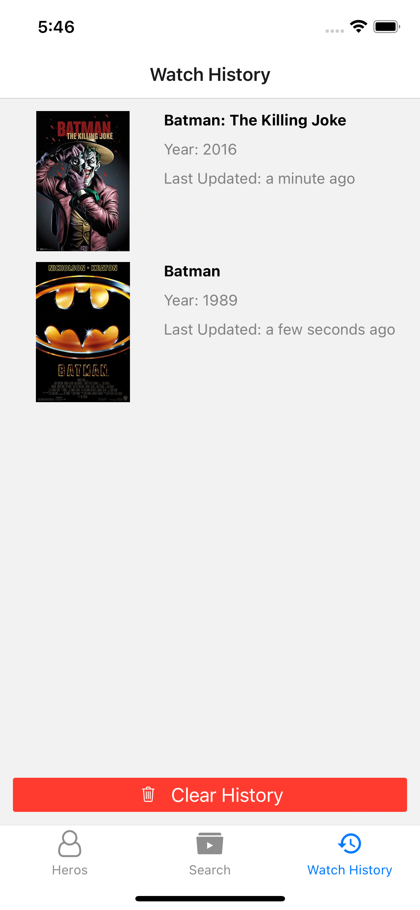

# HeroSpin

## Getting Started

### Install dependencies

1. Install project dependencies node modules

```shell
npm install --legacy-peer-deps --force
```

2. To start development server

```shell
npm start
```

3. To run the application

```shell
npm run ios
# or
npm run android
```

4. Cleanup and fresh install (Optional)

```shell
rm -rf node_modules package-lock.json ios/Pods ios/Podfile.lock
npm install --legacy-peer-deps --force
cd ios && pod install --repo-update
```

### Application screens hierarchy

- **Root Navigation - Bottom Tabs**
  
  1. [TAB] - **Heros**
       1. [SCREEN] - Hero Search
       2. [SCREEN] - Hero Detailed
       3. [SCREEN] - Movie Detailed (Random)
  
  2. [TAB] - **Search**
       1. [SCREEN] - Movie Search
       2. [SCREEN] - Movie Detailed
  
  3. [TAB] - **History**
        1. [SCREEN] - Watch History
        2. [SCREEN] - Movie Detailed (History)

### Application screenshots

|               | Screen 1 | Screen 2 | Screen 3 |
|---------------|----------|----------|----------|
| TAB - Hero    |          |          |          |
| TAB - Search  |           |           |    -      |
| TAB - History |          |          |          |

### Summary

- [HeroSpin](#herospin)
  - [Getting Started](#getting-started)
    - [Install dependencies](#install-dependencies)
    - [Application screens hierarchy](#application-screens-hierarchy)
    - [Application screenshots](#application-screenshots)
    - [Summary](#summary)
